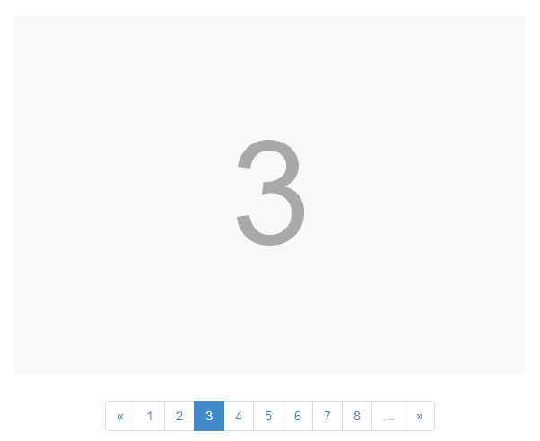

# Bootstrap Pager **[demo](http://4074.github.io/bootstrap-pager)**
### a tiny driver use to show something by pages on front end.



## Usage

To use, you'll need to include files like so.

```html
<!-- in HEAD -->
<link rel="stylesheet" href="/path/to/bootstrap.css">
<!-- at the end of BODY -->
<script src="/path/to/jquery.js"></script>
<script src="/path/to/bootstrap.js"></script>
<script src="/path/to/bootstrap-pager.js"></script>
```

Once you've included those files, you can initialize Pager.

```javascript
$('#myPager').card({
    pages: 12, // the total pages
});
```

You could see the options and mothed on [demo](http://4074.github.io/bootstrap-pager) page.